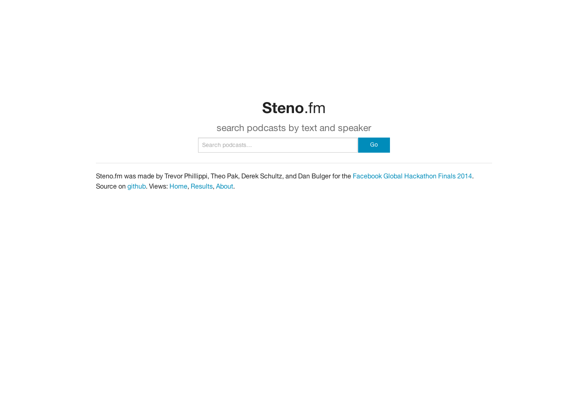

# [Steno](http://steno.fm)

By Dan Bulger, Derek Schultz, Theo Pak, and Trevor Phillippi for the Facebook Global Hackathon Finals 2014.

## Contributing

Use `grunt serve` to run a server on http://localhost:9000.

Use `grunt autoshot` to generate a new screenshot _while a local server is running on port 9000_.

Deploy like this:

> $ grunt build
> $ git commit -am "build for deploy"
> $ git push production master
> $ ssh root@steno.fm
> $ cd /path/to/srv/or/whatever/derek/knows/the/answer
> $ cd frontend/
> $ nodejs web.js
