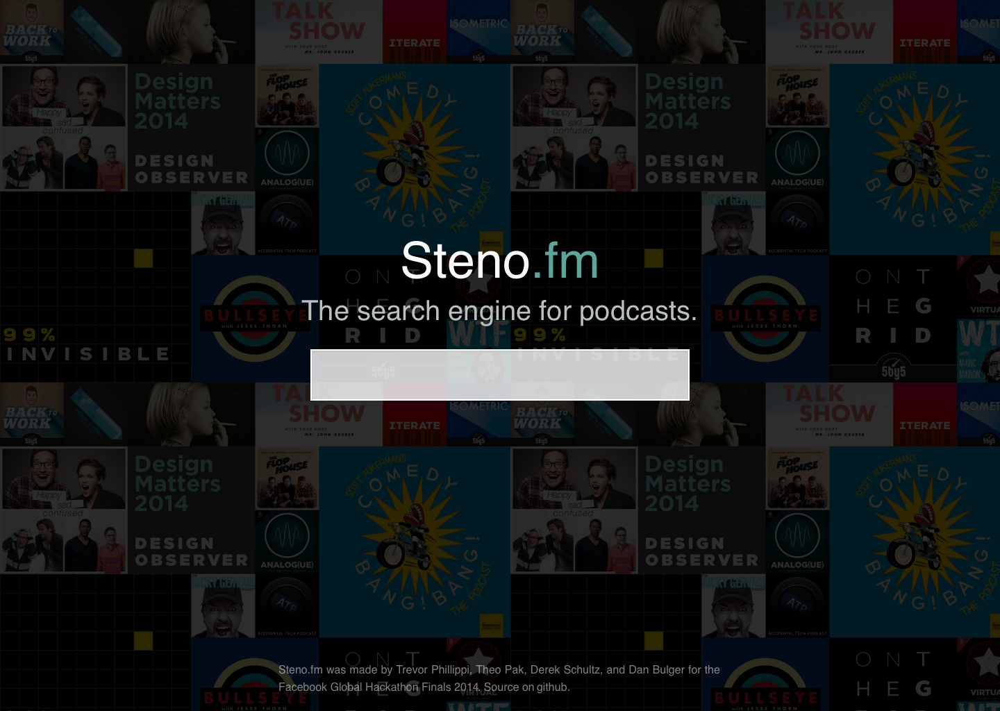

# [Steno.fm](http://steno.fm)

**The search engine for podcasts. Search by phrase, speaker, and podcast title.** Steno.fm started as a 24-hour project at the [Facebook Global Hackathon Finals 2014](http://goo.gl/d4ldms), where the project won an honorable mention.

## Contributing

Pull requests welcome. The steno.fm project has two parts: the web frontend and the indexer.

Get started like this:

    $ git clone https://github.com/theopak/steno.git # get the repo, or pull if you already have it.
    $ cd frontend/                  # the Angular app lives here
    $ npm install -g bower          # install the bower package manager
    $ npm install                   # install dependencies
    $ bower install -g grunt-cli    # install the `grunt` command
    $ bower update                  # install dependencies
    $ grunt build                   # build the Angular app

Use `grunt serve` to run a server on http://localhost:9000. Use `grunt autoshot` to generate a new screenshot _while a local server is running_ on port 9000 (or as configured to in `Gruntfile.js`).

Deploy like this:

    $ grunt build
    $ git commit -am "build for deploy"
    $ git push production master
    $ ssh root@steno.fm
    $ cd /path/to/srv/or/whatever/derek/knows/the/answer
    $ cd frontend/
    $ nodejs web.js

## TODO

- [ ] Client
  - [ ] Rewrite in React Redux
  - [ ] Remove bower and all existing grunt tasks
  - [ ] Add webpack
- [ ] Server (aka "stenodexer")
  - [ ] Open-source
  - [ ] Unit tests
- [ ] Continuous Deployment
